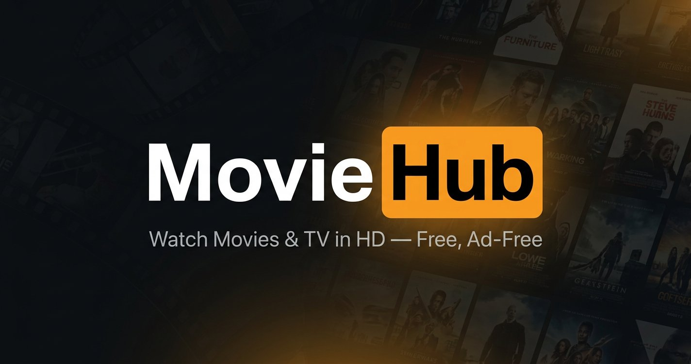

# 🎬 MovieHub



A premium, ad-free, and account-free streaming companion designed for cinema lovers. Discover trending titles, keep track of your watch history, manage a personal watchlist, and watch movies and TV shows in HD with an advanced, built-in **multi-server backup player**.

🖥️ **Live Site:** [https://movie-hub-2.nirjonpc.workers.dev/](https://movie-hub-2.nirjonpc.workers.dev/)

---

## ✨ Features

- **⚡ Instant Streaming:** Stream any movie or TV show in HD resolution directly inside a polished native-feeling player.
- **🛡️ Multi-Server Backup Player:** Switch between **7 high-speed backup streaming servers** (including VidKing, VidLink, VidSrc, and more) with a single tap if one is slow or offline.
- **📂 Personal Collections:** Add items to your **Watchlist** and track your **Watch History** instantly. Everything is safely saved locally on your device (no signups or database accounts required!).
- **🌟 Cast & Star Profiles:** Explore detailed filmographies, birthdays, biographies, and works of your favorite actors.
- **🔍 Smart Search:** Lightning-fast metadata searches across categories, titles, genres, and cast members powered by the TMDB API.
- **📱 Fully Responsive Design:** Stunning dark mode interface custom-built to look flawless on mobile, tablet, and desktop screens.

---

## 🛠️ Tech Stack

MovieHub is built using highly modern and industry-standard frontend technologies:

- **React 19 & TypeScript** - Strict, typed UI components for high reliability.
- **Vite** - Lightning-fast development server and production bundler.
- **Tailwind CSS v4** - Beautiful, customized utility-first responsive layout styling.
- **TanStack (React Query & Router)** - Enterprise-grade routing, state synchronization, and metadata caching.
- **Cloudflare Workers** - Serverless runtime deployment for global high performance.

---

## 🚀 Getting Started

### Prerequisites
Make sure you have Node.js (v20+ recommended) and `npm` installed.

### Setup Instructions

1. **Clone the Repository:**
   ```bash
   git clone https://github.com/shohail-mahmud/movie-hub-2.git
   cd movie-hub-2
   ```

2. **Install Dependencies:**
   ```bash
   npm install
   ```

3. **Run the Development Server:**
   ```bash
   npm run dev
   ```
   Open `http://localhost:5173` on your browser to view the application.

4. **Build for Production:**
   ```bash
   npm run build
   ```

5. **Deploy to Cloudflare:**
   ```bash
   npx wrangler deploy
   ```

---

## 📡 Supported Streaming Servers

Our player includes a smart active indicator light and support for the following embeddable backup stream endpoints:
1. **VidKing** — Default server (custom styled high-quality player)
2. **VidLink** — Fast stream with customized styling
3. **VidSrc.to** — Super reliable backup
4. **VidSrc.xyz** — High-speed multi-server support
5. **VidSrc.me** — Classic streaming provider
6. **VidSrc.cc** — Secondary alternative backup
7. **Embed.su** — High-quality backup with excellent subtitle support

---

## 👨‍💻 Created By

MovieHub was designed and developed with ❤️ by **Shohail Mahmud**. 

Feel free to connect with me on social media or check out more of my work!

- **📸 Instagram:** [@shohailmahmud09](https://instagram.com/shohailmahmud09)
- **🐙 GitHub:** [@shohail-mahmud](https://github.com/shohail-mahmud)

---

## 📄 License & Disclaimer

This is a free, ad-free fan project built for educational purposes and cinematic discovery.
- All movie, TV show, and actor metadata/images are fetched via **[The Movie Database (TMDB) API](https://www.themoviedb.org/)**. This product uses the TMDB API but is not certified or endorsed by TMDB.
- All streaming links are powered by external public embeddable player providers. No media files are hosted or owned on our servers.
